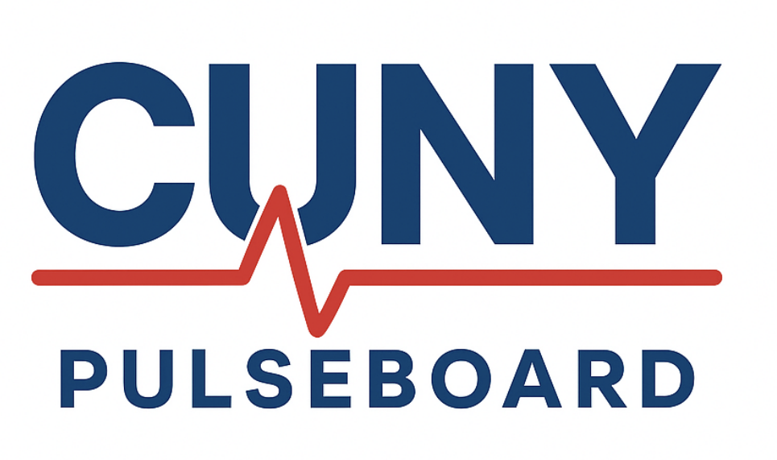
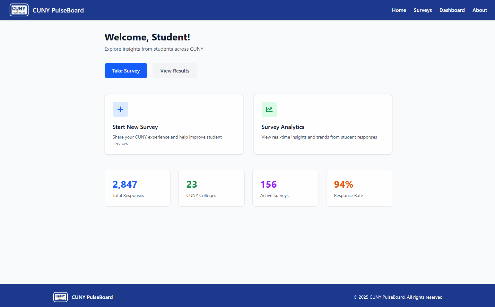

# CUNY PulseBoard 

## A real-time survey and dashboard tool that helps CUNY understand and respond to student needs.

CUNY PulseBoard gives students a voice by turning their feedback into data-driven insights. Through quick and accessible surveys, students can share what resources they need most — whether it’s counseling, food, housing, or academic support. Their responses flow directly into a live dashboard that visualizes trends in real time, enabling administrators to quickly identify issues and take meaningful action to better support the CUNY community.

### Key Features

- 📝 **Student Surveys** – Quick and accessible feedback forms.
- 📊 **Live Dashboard** – Real-time updates with interactive graphs.
- 🗄️ **Database Integration** – Responses stored securely and reliably.
- 🎯 **Actionable Insights** – Helps CUNY target resources where they’re needed most.

<p align="center">
  
</p>

## 📁Project Structure
```
CUNY_PulseBoard/
├── frontend/ # React + Vite frontend
│ ├── public/ # Static files
│ ├── src/ # Main source code
│ │ ├── assets/ # Images, icons, ect
│ │ ├── components/ # Reusable UI components
│ │ ├── pages/ # Application pages
│ │ ├── App.jsx # Root React component
│ │ ├── App.css # Global component styles
│ │ ├── index.css # Base/global styles
│ │ └── main.jsx # Entry point for React
│ ├── index.html # HTML entry point
│ ├── package.json # Frontend dependencies
│ ├── vite.config.js # Vite configuration
│ └── README.md # Frontend-specific documentation
│
├── backend/
│
│
├── media/ # Screenshots, GIFs, and other assets
│ └── Animation.gif
│
└── README.md # Project documentation
```
